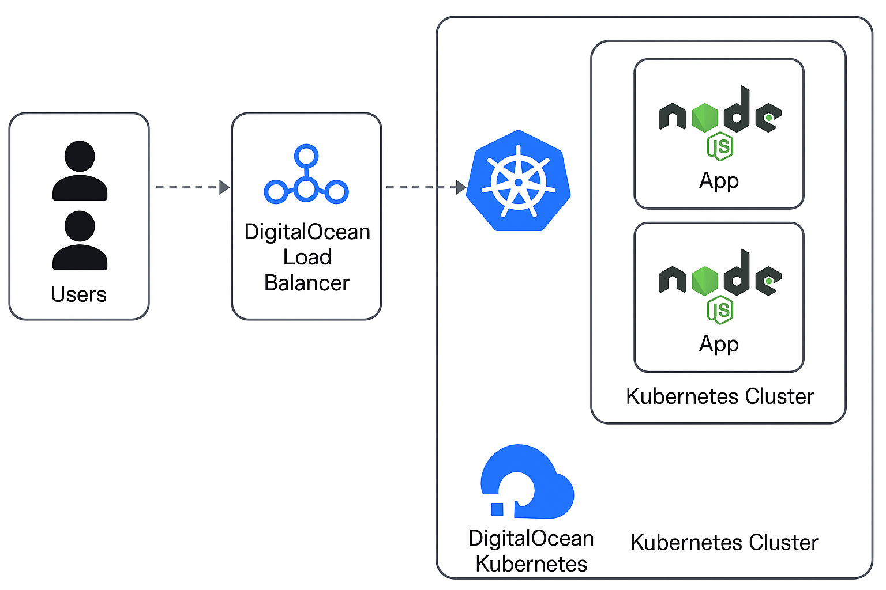

````markdown
# webapp-assignment

A simple containerized Python Flask web application deployed on DigitalOcean Kubernetes (DOKS) using Docker, Helm, and Horizontal Pod Autoscaling (HPA).

---

## 📦 Tech Stack

- Python Flask
- Docker
- Kubernetes (DOKS)
- Helm
- Horizontal Pod Autoscaler (HPA)
- DigitalOcean LoadBalancer
---

## 🏗️ Architecture



---

## 🚀 How to Run Locally

1. **Clone the Repository**

```bash
git clone https://github.com/suraj-cmd/webapp-assignment.git
cd webapp-assignment
````

2. **Run Locally with Docker**

```bash
docker build -t flask-webapp .
docker run -d -p 5000:5000 flask-webapp
```

Open browser at: [http://localhost:5000](http://localhost:5000)

---

## ☁️ Kubernetes Deployment (DOKS)

> Make sure you have `kubectl`, `helm`, and `doctl` configured.

1. **Build and Push Docker Image**

```bash
docker build -t registry.digitalocean.com/YOUR-REGISTRY-NAME/webapp-assignment:latest .
docker push registry.digitalocean.com/YOUR-REGISTRY-NAME/webapp-assignment:latest
```

2. **Update Helm Chart Values**

Edit `helm/values.yaml` with your image details and resource limits.

3. **Deploy Using Helm**

```bash
helm install webapp helm/ --namespace default
```

4. **Enable Horizontal Pod Autoscaler (HPA)**

```bash
kubectl apply -f k8s/hpa.yaml
```

---

## 📈 HPA Configuration

HPA scales the application pods between 1 and 5 replicas based on CPU utilization above 50%.

```yaml
apiVersion: autoscaling/v2
kind: HorizontalPodAutoscaler
...
```

---

## 🔒 Cost Optimization

* Used LoadBalancer instead of Ingress for simplicity.
* Right-sized resources (`cpu: 100m`, `memory: 128Mi`) with auto-scaling.
* Consider Downscaling to 0 replicas on idle using KEDA (future).

---

## 📊 Performance Testing (Optional)

```bash
hey -z 1m -c 50 http://<LoadBalancer-IP>/
```

---

## 🧩 To Do

* Add CI/CD with GitHub Actions
* Enable Ingress + TLS via cert-manager
* Add liveness/readiness probes

---

## 🙋‍♂️ Author

**Suraj Rajendra Patil**
📧 [surajpatil522@gmail.com](mailto:surajpatil522@gmail.com)
🌐 [GitHub: suraj-cmd](https://github.com/suraj-cmd)
